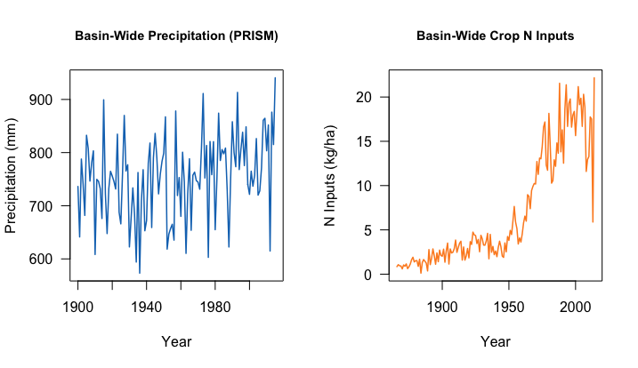

Read in <a href="https://cfpub.epa.gov/roe/indicator.cfm?i=33">observed</a> and Van Meter predicted MRB loading datasets and convert to consistent kg/hectare units.


``` r
## MRB area is 291451362.1ha, and scaling by .00110231 converts tons to kg
mrbKG = mrb / 291451362.1  / .00110231
mrbDat = data.frame(year = 1955:2014, loadObserved = mrbKG)
vmPred = read.csv('./VM_predicted.csv', head=T) #Predicted load in kilotons
vmPred$loadPredVanMeter = vmPred$load / 291451362.1  / .00110231 * 1000 # convert to kg/ha
mrb = left_join(mrbDat, vmPred) 
head(mrb)
```

    ## year loadObserved loadPredVanMeter
    ## 1 1955     1.475376         1.192663
    ## 2 1956     1.036194         1.072244
    ## 3 1957     1.478807         1.445550
    ## 4 1958     1.266078         1.472036
    ## 5 1959     1.142558         1.260760
    ## 6 1960     1.108247         1.227245

## Precipitation and excess crop nitrogen
Precipitation is a dominant driver of nitrogen runoff, so I downloaded free 4km resolution precipitation data from PRISM and extracted annual estimates of total precipitation over the Mississippi River Basin watershed. Working with shapefiles in R has become much easier using the `ncdf4 package`, though computation speeds can be slow for large shapefiles. Let's take a look at the basin-wide annual precipitation and annual excess nitrogen from croplands.


Test again



Test again
``` r
par(mfrow=c(1,2))
  plot(precip.df$year, precip.df$precip, type='l', ylab='Precipitation (mm)', xlab='Year', las=1, col='#1175BE',    lwd=1.5, main='Basin-Wide Precipitation (PRISM)', cex.main=.9)
  plot(surplus.df$year, surplus.df$crop.surplus, type='l', ylab='N Inputs (kg/ha)', xlab='Year', las=1, col='#FD8B25', lwd=1.5, main='Basin-Wide Crop N Inputs', cex.main=.9)
```


Next I read in the chloropigment data from Rabalais et al. (MPB 2004). I also verify the R2 values they provide for their model vs. the pigments. I recreate their R2 values very nearly for the 1960-1997 period (noting that the N load estimates I have are from the GBC paper, so may be slightly different than those used in the updated Science paper) but are a bit lower than reported in the 1820-1930 period.


